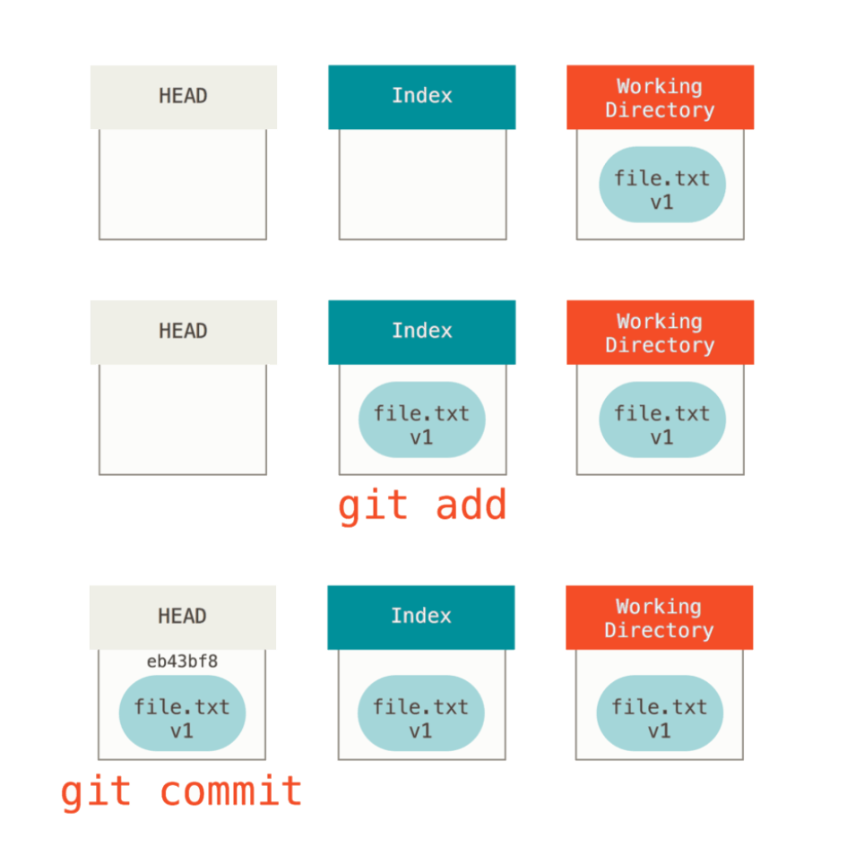
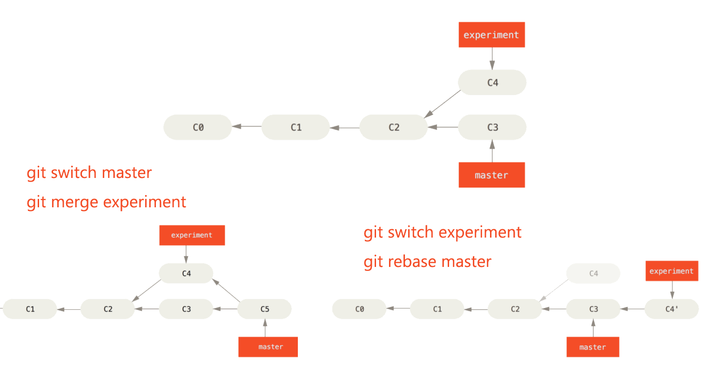

# Git

## 内容简介

本文记录了一些个人认为比较常用的命令，每个命令也仅涉及常用的几个参数。

故文本可作为简要的目录使用，偶有遗忘之时作快捷参考，更具体的使用可以再运行 `git <verb> --help` 查阅。

文末的**常用场景**将随着本人日常使用进行持续更新，敬请期待。

## 安装指引

由于 centos 使用 `yum install git` 安装的默认版本太旧，自行安装新版 git 。 

首先安装依赖：

```
yum install curl-devel expat-devel gettext-devel openssl-devel zlib-devel gcc perl-ExtUtils-MakeMaker
```

然后，可寻找合适的 git 版本：https://mirrors.edge.kernel.org/pub/software/scm/git/ 。

```
cd /usr/local
wget https://mirrors.edge.kernel.org/pub/software/scm/git/git-2.8.6.tar.gz
tar -zxvf git-2.8.6.tar.gz
cd git-2.8.6
make prefix=/usr/local/git all
make prefix=/usr/local/git install
```

接下来，配置环境变量，先  `vim /etc/profile`  然后在下面添加：

```
export PATH=/usr/local/git/bin:$PATH
```

再 `source /etc/profile` 使环境变量生效。

最后，使用 `git --version` 查看版本。

## 配置信息

**查看配置**

查看所有配置及所在的文件：

```
git config --list --show-origin
```

**用户信息**

配置用户信息，`--global` 对所有仓库生效或使用 `--local` ：

```
git config --global user.name DougZheng
git config --global user.email 739168993@qq.com
```

**文本编辑器**

配置文本编辑器，未配置则使用系统默认的文本编辑器：

```
git config --global core.editor vim
```

## 获取帮助

**查看命令帮助**

`git <verb> --help` 或 `git <verb> -h` 查看快速参考：

```
git add --help
git add -h
```

## 获取仓库

**初始化本地目录**

`git init` ，将本地目录初始化为 Git 仓库：

```
mkdir repo && cd repo
git init
```

**克隆 Git 仓库**

`git clone <repo> [<dir>]` ，克隆 `repo` ，本地命名为 `dir` ：

```
git clone https://github.com/DougZheng/Skills myskills
```

## 记录更新

**三个区域**

- HEAD ，当前分支引用的指针，可以看作**当前分支上的最后一次提交**的快照。
- Index ，**预期的下一次提交**，即所谓的“暂存区”。
- Working Direcory ，修改进入暂存区之前的本地工作状态，工作区。

典型的工作流程如下图所示：



**文件状态**

文件的状态变化周期如下图所示：


使用 `git status` 查看当前所有文件状态：

- Untracked(Untracked files)：未跟踪，使用 `git add` 跟踪文件。
- Unmodified ：未修改，说明已跟踪的文件与暂存区内容相同。
- Modified(Changes not staged for commit)：已修改未暂存，说明已跟踪的文件与暂存区的内容不同，使用 `git add` 暂存修改。
- Staged (Changes to be committed)：已暂存，即通过 `git add` 添加到暂存区中，等待提交。

**暂存文件**

`git add <path>...` 将工作区的文件变化（包括新增、修改、删除）暂存，同步到暂存区：

```
git add .  # 暂存当前目录所有文件
git add -A # 暂存所有文件
```

也可以通过 `git add -i` 交互，选择需要暂存的文件。

**查看差异**

`git diff [--] [<path>...]` 查看工作区与暂存区的文件差异（已暂存的内容），`--` 用来分隔后面的文件路径，非必须：

```
git diff # 不指定 path，默认为全部文件
```

`git diff --cached [<commit>] [--] [<path>...]` 查看暂存区与 `<commit>` 的文件差异（即将要提交的内容）：

```
git diff --cached # commit 不给默认为 HEAD 
```

**提交更新**

`git commit -m <message>`  将暂存区提交，生成一次快照：

```
git commit -m "write something here"
```

**忽略文件**

一般会希望一些文件不被纳入 Git 的管理，可以创建一个名为 `.gitignore` 的文件，一个例子：

```
# 忽略所有的 .a 文件
*.a
#但跟踪所有的 lib.a，即便前面忽略了 .a 文件
!lib.a
# 只忽略当前目录下的 TODO 文件，而不忽略 subdir/TODO
/TODO
# 忽略任何目录下名为 build 的文件夹，但不忽略 build 文件
build/
# 忽略 doc/notes.txt，但不忽略 doc/subdir/notes.txt
doc/*.txt
# 忽略 doc/ 目录及其所有子目录下的 .pdf 文件
doc/**/*.pdf
```

若文件已被跟踪，可以使用 `git rm --cached <path>` 将其在暂存区中移除，再提交删除修改即可。

## 查看历史

**提交历史**

`git log` 查看提交历史，常用几个选项：

`-p` ，按补丁格式显示每个提交引入的差异。

`--stat` ，显示每次提交的文件修改统计信息。

`--oneline` ，每次提交以单行显示简短信息。

`--graph` ，以 ASCII 图形显示分支与合并历史。

`--all` ，查看所有分支信息。

`-<n>` ：仅显示最近的 `n` 条提交。

`--no-merges` ：不显示合并历史。

`-S` ：仅显示添加或删除内容匹配指定字符串的提交。

**操作历史**

`git reflog` 查看历史操作记录，包括删除的 commit 记录和 reset 操作，可找回误删的旧版本。

## 撤销操作

**撤销工作区文件的修改**

`git restore <path>...` 默认参数 `--worktree` ，即撤销工作区文件的修改：

```
git restore .gitignore # 工作区 <- 暂存区
```

**取消暂存的文件**

`git restore --staged <path>...` ，取消暂存的文件，`git add` 的逆操作：

```
git restore --staged .gitignore # 暂存区 <- HEAD
```

**修订上一次提交**

`git commit --amend` 修订上一次提交，会顺带再合并提交一次暂存区，**最好不要修订线上提交**：

```
git commit -m "first commit"
git add -A
git commit --amend # 及时补充一些修改到上次提交，commit-id 会变
```

**回退到指定版本**

`git reset --hard <commit>` ，回退到指定版本，**工作区、暂存区、HEAD** 都会改变：

```
git reset --hard HEAD
```

**撤销某一次提交**

`git revert -n <commit>` ，撤销 `<commit>` 并生成一次新的提交，`-n` 不自动提交：

```
git revert -n HEAD # 撤销上一次提交，不加 -n 会自动生成一次新的提交
```

## 远程仓库

**查看远程仓库**

`git remote` 查看远程仓库，`git clone` 下来的默认远程主机名为 `origin` ：

```
git remote -v # -v 显示读写远程仓库对应的 url
```

**添加远程仓库**

`git remote add <name> <url>`  添加一个新的远程仓库 `url` 并指定名字为 `name` ：

```
git remote add SS709 https://github.com/DougZheng/StormSmash_709
```

 **从远程仓库拉取**

`git fetch [<repo>]` 拉取远程仓库 `<repo>` 所有分支的最新数据：

```
git fetch # 不给定 repo，默认拉取 origin
```

`git pull`  等效于 `git fetch` + `git merge FETCH_HEAD` ：

```
git pull # 默认拉取 origin，FETCH_HEAD 是跟踪的远程分支
```

**推送到远程仓库**

`git push [<repo> [<refspec>...]]` ：

```
git push # 默认是 git push origin master，具体同样是看跟踪信息
```

**查看某个远程仓库**

`git remote show <repo>` 查看远程仓库的 url 和跟踪分支等信息。

**重命名与移除**

`git remote rename <old> <new>` 进行远程仓库重命名：

```
git remote rename SS709 StormSmash_709
```

`git remote remove <repo>` 进行远程仓库的移除：

```
git remote remove StormSmash_709
```

## 分支管理

**创建分支**

`git branch <branch>` 创建分支 `<branch>` ：

```
git branch dev
```

**切换分支**

`git switch <branch>` 切换到分支 `<branch>` ：

```
git switch dev
```

使用 `git switch -c <branch>` 一步到位，创建并切换到分支 `<branch>` 。

**查看分支**

`git branch -vv` 查看本地所有分支指向情况和远程跟踪分支。

`git branch -r` 查看所有远程分支。

`git branch --merge [<branch>]` 查看所有已合并到 `<branch>` 的分支。

`git branch --no-merge [<branch>]` 查看所有未合并到 `<branch>` 的分支，不指定 `<branch>` 则为当前分支。

**合并分支**

`git merge <branch>` 合并 `<branch>` 到当前分支：

```
git merge origin/master
```

**删除分支**

`git branch -d <branch>` 删除已合并的分支 `<branch>` ：

```
git branch -d dev
```

若有未合并工作，使用 `-D` 强制删除。 

**跟踪远程分支**

`git branch -u <upstream>` 设置当前分支正在跟踪的上游分支：

```
git branch -u origin/master
```

**变基**

`git rebase <branch>` ，找到当前分支与 `<branch>` 的最近公共祖先，提取当前分支相对于该祖先的修改，将当前分支指向基底 `<branch>` 依次应用这些修改，得到与 `<branch>` 串行的一个版本，再切换到 `<branch>` 可以快速合并该分支：

```
git switch dev
git rebase master
# 切回 master 执行快速合并
git switch master
git merge dev
```

变基的好处是使得提交历史是一条线，减少了分支合并历史，建议是只在本地开发时使用变基，这样历史记录会更清晰。

> **如果提交存在于你的仓库之外，而别人可能基于这些提交进行开发，那么不要执行变基。**

变基与合并对比图：



## 贮藏工作

**贮藏工作**

`git stash push -m <message>` 将当前分支的修改贮藏，`-m` 添加备注：

```
git stash -m "save something" # push 也可以不加
```

`git stash push --keep-index` ，`--keep-index` 选项使得贮藏后暂存区的修改还存在（使用部分修改继续进行工作）。 

`git stash push -u` ，`-u` 选项使得也会贮藏未跟踪的文件（否则需要先手动 `git add` ）。

**查看贮藏列表**

`git stash list` 查看贮藏的列表。

**查看贮藏改动**

`git stash show [stash@{n}]` 查看贮藏 `stash@{n}` 的改动：

```
git stash show # 不指定一个贮藏，则默认是最近的贮藏 stash@{0}
```

`git stash show -p` ，`-p` 选项以补丁形式打印改动。

**应用贮藏的工作**

`git stash apply [stash@{n}]` 重新应用贮藏的工作：

```
git stash apply # 不指定一个贮藏，则默认是最近的贮藏 stash@{0}
```

 `git stash apply --index` ，使用 `--index` 选项让原本暂存区的贮藏也同样恢复，否则需要重新 `git add`。

`git stash pop` 等效于 `git stash apply` + `git stash drop` 。

**移除贮藏**

`git stash drop [stash@{n}]`

```
git stash drop # 不指定一个贮藏，则默认是最近的贮藏 stash@{0}
```

`git stash clear` 删除所有贮藏。

## 常用场景

// TODO

## 参考来源

- <https://git-scm.com/book/en/v2>
- <https://www.liaoxuefeng.com/wiki/896043488029600>

