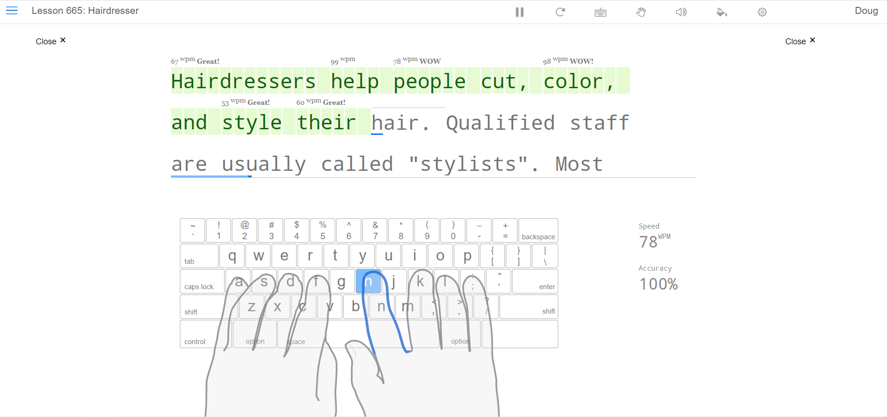

# Typing

## 前言

个人认为打字也算是一项重要技能，大多数人（包括我）可能并没有刻意对这方面进行练习，而是自接触键盘时便随意敲打，至今可能仍使用四指、二指甚至一指来打字。或许使用这样的打字方式也能达到不错的速度，但这样的打字定位方式往往不甚准确，以至于不能实现真正的盲打。在我看来，学习使用**标准指法**打字，能够有相对合理的手指分工，由此带来的益处至少有如下三点：

1. 手指、手腕移动幅度小，不易疲劳。
2. 承接第一点，按键更精准，更容易实现盲打。
3. 承接前两点，打字速度上限更高。

此外，改变打字指法的时间代价也相对较小，但提升效果却是显而易见的。以我个人为例：

1. 练习前，四指禅，平均 40 wpm 。
2. 键位练习十小时，恢复原先速度 40 wpm 。
3. 单词、短文练习，每天半小时，肉眼可见每天进步约 5 wpm 直到 60 wpm 。
4. 持续一两周后，更换合适的键盘（笔记本薄膜键盘到机械键盘），达到 70 wpm 。
5. 往后没有刻意练习，平均速度仍然保持 70 wpm 左右，一分钟瞬时可达 120 wpm ，或许是看得到的上限。

这里谈及的打字速度，都是假定在英文情况下。

## 练习

如今有很多打字网站提供了练习课程，课程当然也有付费和免费两大类，但不同网站练习内容也有差异。有的网站仅局限英文字母的键位练习，缺乏数字、特殊符号的键位练习，但正常英文打字情况下难免会混杂数字、特殊符号，若不加练习，会严重影响整体打字速度。对编程来讲，这更是致命的。

这里推荐 <https://www.typingclub.com/> ，优点是练习键位涵盖字母、数字和特殊符号，界面整洁，课程除了少数游戏关卡，基本免费，不需要科学上网。缺点是访问较慢。

## 术语

**wpm** ：words per minute ，即每分钟单词数。

**kpm** ：keystrokes per minute ，即每分钟击键次数。

换算关系：1 wpm = 5 kpm 。

## 参考

- <https://www.typingclub.com/>

