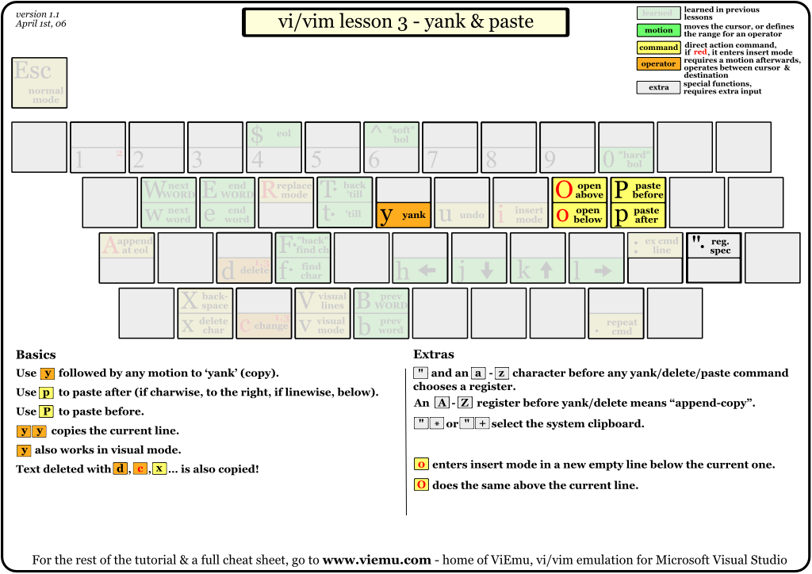

# Learn-Vim

## Ch01. Staring Vim

**vim** [file...] ：使用 `vim` 编辑，`file` 指定打开文件。

**Tab** ：命令模式下按 `tab` 键自动补全命令。

**:h[elp]** [subject] ：查看帮助手册， `subject` 指定关键字。

**:w[rite]**[!] [file] ：保存，`!` 强制保存，`file` 指定写入的文件。

**:q[uit]**[!] ：退出，`!` 强制退出，不保存。

**:wq**[!] [file] ：`w` 和 `q` 的组合。

**ctrl + z** ：挂起进程，可用 `jobs` 查看， `fg` 切换回前台。

## Ch02. Buffers, Windows and Tabs

**:buffers** ：查看所有缓冲区。

**:buffer** [file|n] ：切换到 `file` 对应的缓冲区，或编号为 `n` 的缓冲区。

**:bdelete** [file|n] ：移除 `file` 对应的缓冲区，或编号为 `n` 的缓冲区。

**:qa[ll]**[!] ：退出所有缓冲区，`!` 强制退出。

**:wqa[ll]**[!] ：保存并退出所有缓冲区，`!` 强制执行。

**:sp[lit]** file ：打开 `file` 并水平分割窗口。

**:vs[plit]** file ：打开 `file` 并竖直分割窗口。

**ctrl + w** h|j|k|l ：在窗口间移动。

**:tabnew** file ：在新的选项卡中打开 `file` 。

**:tabclose** ：关闭当前选项卡。

**gt | gT** ：`gt` 切换到下一选项卡，`gT` 切换到上一选项卡。

**vim** [-p|-o|-O] file... ：`-p` 以多选项卡形式打开 `file` ，`-o` 水平分割窗口打开，`-O` 竖直分割窗口打开。

## Ch03.  Opening and Searching Files

**:e[dit]**[!] [file] ：默认重新打开当前文件，`file` 指定打开的文件，会新建文件。

**:find** file ：查找 `file` ，不会新建文件，在 `path` 中查找。（可设置 `:set path+=your_dir` ）

**:grep** ：同 `grep` 。

**netrw** ：vim 内置文件浏览器，故可打开目录。

## Ch04. Vim Grammar

**Verb + Noun** ：vim 命令的组成形式。

**Nouns (Motions)** ：`h` `j` `k` `l` `w` `}` `$` 等等。

**Verbs (Operators)** ：`y` `d` `c` 等等。

**More Nouns (Text Objects)** ：`i + object` 或 `a + object` ，详见 `:help text object` 。

**Filter Operator (!)** ：可用来使用外部命令。

## Ch05. Moving in a File

[n] **h|j|k|l** ：左下上右移动一个字符位置，`n` 指定移动的行数/列数。

**w|W  b|B  e|E** ：`w` 移动到下一个 word 的开头，`b` 移动到上一个 word 的开头，`e` 在 word 的结尾移动。大写 `WBE` 在 WORD 移动。

**0  ^  $  g_** ：`0` 移动到本行第一个字符，`^` 到本行第一个非空白字符，`$` 到本行最后一个字符，`g_` 到本行最后一个非空白字符。

**ctrl + f|b** ：`ctrl+f` 向下翻页，`ctrl+b` 向上翻页。

**f|F**{char} [;|,]... ：`f{char}` 查找本行下一个出现的 `char` ，`F` 反向查找，`;` 正向继续查找，`,` 反向继续查找。

**(|)  {|}** ：`(` 移动到上一 sentence ，`)` 移动到下一 sentence ，`{` 移动到上一 paragraph ，`}` 移动到下一 paragraph 。

**%** ：在匹配的 `()` 、`[]` 、`{}` 间跳转。

**gg  G  nG  n%** ：``gg` 移动到第一行，`G` 移动到最后一行，`nG` 移动到第 `n` 行，`n%` 移动到全文件 `n%` 的位置。

**/|?**{pattern} [n|N]... ：`/{pattern}` 查找下一个出现的 `pattern` `?` 反向查找，`n` 正向继续查找，`N` 反向继续查找。

**\*|#  g*|g#** ：`*` 查找下一出现在当前光标处的单词（全匹配），`g*` 仅匹配子串。`#` 和 `g#` 同理，但反向查找。

**m|'**{char} ：`m{char}` 用 `char` 标记当前位置，`'{char}` 回到标记 `char` 的行。

## Ch06. Insert Mode

**i|I  a|A  o|O** ：`i` 在光标前插入，`a` 在光标后插入，`o` 在下方新建一行插入，`O` 在上方新建一行插入，`I=^i, A=$a` 。

## Ch07. The Dot Command

**.** ：重复上一修改命令（移动命令不算）。

## Ch08. Registers

**y  d  p** ：`y` 复制，`d` 删除，`p` 粘贴，默认使用匿名寄存器 `""` 。

**"0** ：复制寄存器，存放上一次 `y` 的内容。

**"1-9** ：编号寄存器，修改或删除至少一整行文本时，会自动按时间顺序存放在 `"1-9` 中，`"1` 为最近的一次。

**"a-z** ：命名寄存器，可自行使用，`"ay` 即用寄存器 `"a` 复制，`"ap` 即粘贴寄存器 `"a` 的内容。

**"+|"\*** ：选取寄存器，与外部程序相通的粘贴板。

## Ch09. Macros

**qa** ：录制宏 `a` ，按 `q` 结束录制，可用宏有 `a-z` 。

**@a** ：使用宏 `a` 。

**qaq** ：即清空宏 `a` 。

## Ch10. Undo

**u** ：撤销上次修改。

**ctrl + r** ：重做上次修改。

## Ch11. Visual Mode

**v|V** ：`v` 进入逐字符可视模式，`V` 进入逐行可视模式，按 `o` 切换光标位置。

## Ch12. Search and Substitute

**:/\c** ：`\c` 搜索时不区分大小写，`\C` 区分大小写。搜索支持正则表达式，转义字符 `\` 。

**:%s**/{old-pattern}/{new-pattern}/[g|c|i|I]... ：替换每行第一个 `old-pattern` 为 `new-pattern` ，`c` 替换前询问，`i` 不区分大小写，`I` 区分，`g` 全部替换。

## Ch13. The Global Command

**:g**/{pattern}/{command} ：对所有匹配 `pattern` 的行执行 `command` ，可在 `g` 前加范围限定。

## Ch14. External Commands

**:!**{cmd} ：执行外部命令 `cmd` 。

**:r **!{cmd} ：读取外部命令 `cmd` 的执行结果。

**:w **!{cmd} ：当前缓冲区作为外部命令 `cmd` 的输入。

## Ch15. Command-line Mode

**ctrl + [** ：回到普通模式。

## Ch16. Tags

## Ch17. Fold

## Ch18. Git

## Ch19. Compile

## Ch20. Views, Sessions and Viminfo

## Ch21. Vimrc

## Reference

- <https://github.com/iggredible/Learn-Vim>
- <https://vim.fandom.com/wiki/Did_you_know>